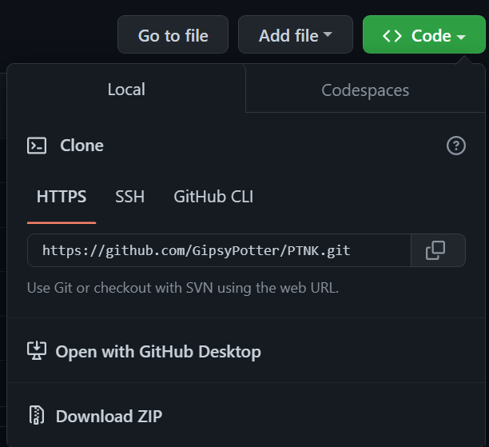

# TN3 IT directory
This is a directory of all the IT related things that we do at TN3.
## Installation
### Requirements
C++ editor and compiler. Suggest using Visual Studio Code and MinGW or [Clion](https://www.jetbrains.com/clion/)
### Setup
1. Click the green "Code" button
2. Click "Download ZIP"
3. Extract the ZIP file
4. Open the folder in your editor of choice

## Contributing

All errors and suggestions are welcome. Please notify us of any errors or suggestions by contact via email, Discord or message on the TN3 group.
## License

[MIT](https://choosealicense.com/licenses/mit/)
